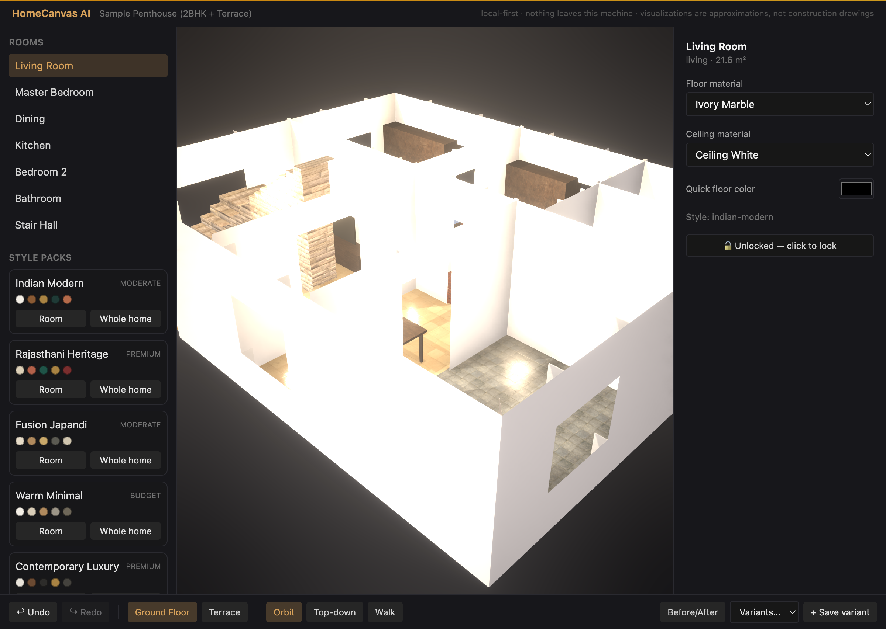

# HomeCanvas AI

Turn a 2D residential floor plan into an **interactive, near-photoreal, editable 3D home** — explore materials, colors, furniture, and Indian-context design styles, move walls and stairs, then save and compare variants. **Local-first: your files never leave this machine.** No paid APIs anywhere.

🎬 **[Watch the demo](docs/homecanvas-demo.mp4)** (narrated; built with Remotion — see [`demo-video/`](demo-video/README.md))



## Quick start

Requires **Node ≥ 22.13** (built-in fetch + modern ESM; pdf.js needs it too).

```bash
npm install
npm run dev          # web app on http://localhost:5173 + local sidecar on 127.0.0.1:4871
```

Open http://localhost:5173 → **Sample Penthouse** → click rooms/walls/stairs/furniture in the canvas (or the room list), swap materials, apply style packs, add furniture, rename rooms, undo (⌘Z), save variants.

**Strongly recommended once** (~25 MB, makes materials and lighting dramatically better):

```bash
npm run fetch:assets   # CC0 PBR textures + HDRIs + glTF furniture (Poly Haven) → asset-cache/
```

Everything still works without it — materials fall back to flat PBR colors, furniture to procedural placeholders, and the environment to procedural light panels.

### Verify the build

```bash
npm test          # Vitest — 262 tests
npm run typecheck # tsc --noEmit (strict)
npm run lint      # ESLint
npm run build     # production bundle
```

### Cross-platform

Everything is cross-platform (`node:path`, no bashisms, npm scripts only). Rendering auto-degrades on weaker GPUs (e.g. a GTX 1060). WebGL2 is required for the 3D canvas and the path-traced Photo Mode.

## What you can do

- **Interactive 3D canvas** (archviz-lite): AgX tone mapping, HDRI image-based lighting, N8AO ambient occlusion, PCF soft shadows, SMAA + bloom. Orbit / top / first-person **walk** / guided **tour** views.
- **Edit the home**: select any room/wall/stair/furniture → swap materials, recolor, apply one of **12 style packs**, add furniture, **rename rooms**, **delete a pillar** (with a structural-instability warning), **move & rotate staircases** (nudge/rotate panel + drag handles in the tracer).
- **Trace your own plan**: upload a PDF/image, set scale from a known dimension, then snap-assisted tracing of walls/rooms/openings over the underlay, with a live 3D preview. Heuristic auto-extraction (raster CV + OCR'd labels/dimensions, DXF, optional DWG) gives you a starting point.
- **AI design chat** (offline by default): a deterministic MockAgentProvider parses requests ("add a sofa to the lounge", "3 variants of the master bedroom", "make the drawing room warmer") into previewable, approve-before-apply edits. An optional local **Claude bridge** adds vision/judgment (see Privacy).
- **Reference images**: attach a photo in chat to extract a palette and recolor a room, or persist it as a room reference.
- **Photo Mode**: a progressive GPU path tracer (three-gpu-pathtracer) renders a near-photoreal still; pick a camera preset (Angled/Top/Front) or drag to orbit, watch samples accumulate, then save a PNG.
- **Variants & compare**: save named variants, a side-by-side before/after slider, and per-room design boards. Export the scene as JSON.

Everything routes through **one validated commit pipeline**, so undo/redo and entity locks always hold.

## Using your own home

Your real files live in a **gitignored, never-uploaded** folder:

```bash
npm run init:private     # creates private-home-inputs/ with the full layout
# drop files in:
#   private-home-inputs/raw/floor-plan-main.pdf (or .png/.jpg)
#   private-home-inputs/raw/*.dwg|*.dxf                 (optional CAD)
#   private-home-inputs/raw/site-photos/                (photos of your empty rooms)
#   private-home-inputs/raw/reference-tiles|furniture|colors|moodboards/
npm run detect:private   # see what the app recognizes
```

The home screen shows a **My Home** card when files are detected. Use the **Trace plan** wizard (upload → scale → trace → verify) to turn your plan into a scene, or start from the sample home and reshape it. The bundled sample penthouse means the app fully demos **without any private data**.

> The maintainer's real penthouse trace data (`scripts/trace/*.json`) is intentionally **not** in this repo — only the anonymized sample home ships. The tracing tooling (`scripts/trace/*.mjs`) and the scene generator are included, but you bring your own plan.

## Privacy guarantees

- `/private-home-inputs/`, `/asset-cache/`, and `/.homecanvas/` are gitignored.
- All processing is local: the only backend is a sidecar bound to `127.0.0.1` with an Origin check (so random websites can't poke a localhost API that reads your files).
- There is **no code path that uploads anything**. Asset fetching is download-only (CC0 from Poly Haven).
- The Claude bridge is **off by default and disclosed**. Two modes, both local:
  - **Human-driven** (`HOMECANVAS_ENABLE_BRIDGE=1`): the app drops a request file; you run `npm run bridge:pending` in a local Claude Code session, which answers it.
  - **Auto** (`HOMECANVAS_ENABLE_BRIDGE=1 HOMECANVAS_BRIDGE_AUTO=1`): the sidecar answers each request by invoking your local `claude -p` CLI. ⚠️ This drives **your** Claude Code (your subscription) — Anthropic's policy reserves headless/automated use for API-key auth, so the bridge is human-driven by default and you enable auto explicitly. The app still uploads nothing; the scene is passed only to your own local `claude` process. Every proposal is schema-validated and applied through the commit pipeline (locks honoured).

Errors surface on screen (a global error boundary + toast for commit rejections, failed saves, and uncaught runtime errors) so nothing fails silently.

## Architecture

```
Vite SPA (React 19 + R3F)        Hono sidecar (127.0.0.1)
  renderer = pure projection  ←→   fs: scenes/variants/manifest/assets/jobs/bridge
  of the scene graph                 (atomic temp+rename writes)
        ↓ every edit
  ScenePatch (zod-validated domain ops)
        ↓
  ONE commit pipeline (lib/scene/commit.ts):
    parse → immer produceWithPatches → effect-set lock check
    → full validation → per-variant log entry
```

Three rules everything follows:

1. **The scene graph is the source of truth** — a zod-validated JSON document (`lib/scene/schemas.ts`). The renderer never owns state; agents never touch meshes.
2. **Deterministic code does geometry; AI does judgment.** Wall mitering, opening cuts, stairs, collision, validation, undo — all pure TypeScript in `lib/geometry` + `lib/scene`, heavily unit-tested. No CSG: walls are a **wall-network** (mitered junction outlines, interval-merged parametric openings, continuous UVs).
3. **Undo/redo replays inverse patches through the same validation gate** — locks cannot be bypassed, not even by undo. Locks guard an *effect set* (any entity whose bytes would change), so indirect edits (style sweeps, shared-material copy-on-write) are caught too.

Key directories:

| Path | What lives there |
|---|---|
| `lib/scene/` | schemas (zod 4), commit pipeline, validation, migrations, reconcile/diff |
| `lib/geometry/` | wall-network, rooms/polygons, parametric stairs, collision (SAT/OBB), scale/calibration |
| `lib/styles/` | material library, 12 style packs, pack→patch expansion |
| `lib/agent/` | provider interface; deterministic MockAgentProvider (default); Claude bridge protocol; correction proposals |
| `lib/furniture/`, `lib/extraction/`, `lib/tracing/`, `lib/boards/` | catalog + placement, raster/CV + OCR extraction, tracing helpers, design boards |
| `lib/fixtures/` | committed sample penthouse; private-home detection |
| `src/` | React app: canvas (incl. Photo Mode), inspector, plan tracer, chat, panels, store, error surface |
| `server/` | Hono sidecar: scene/variant/asset/job/bridge/export routes |
| `scripts/` | `init:private`, `detect:private`, `fetch:assets`, bridge + generation tools |

## Honest limitations (also shown in-product)

- Uploaded 2D plans need manual verification; dimensions are approximate unless you confirm them.
- Visualizations are for **design exploration, not construction drawings**.
- Furniture sizes/materials are approximations; Indian-specific pieces (charpai, jhula, pooja unit) have no CC0 source yet and use nearest-aesthetic placeholders.
- Curved walls are stored in the schema (arc-ready) but rendered as straight; straight walls at any angle work.
- DWG support depends on a user-installed converter (ODA File Converter or `brew install libredwg`) — never bundled, never cloud.
- This is a **personal-use v1**: some optional ML boosters are NC-licensed and isolated behind flagged adapters (swap before any commercial use). The core app + asset pipeline stay permissive (MIT/Apache/CC0).
- AI suggestions are design aids, not a replacement for an architect or interior designer.

## License & assets

Code is for personal use. Bundled/fetched assets are **CC0** (Poly Haven, ambientCG). Run `npm run fetch:assets` after cloning to populate the local cache.
